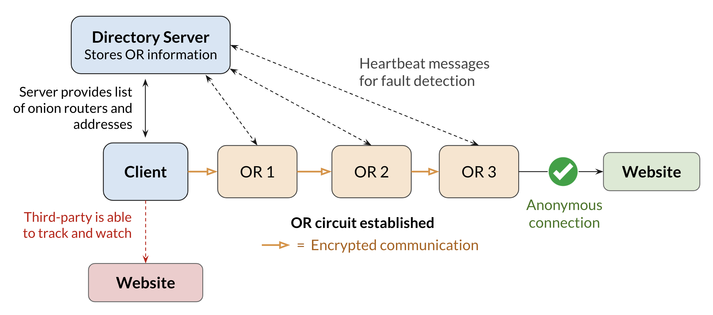
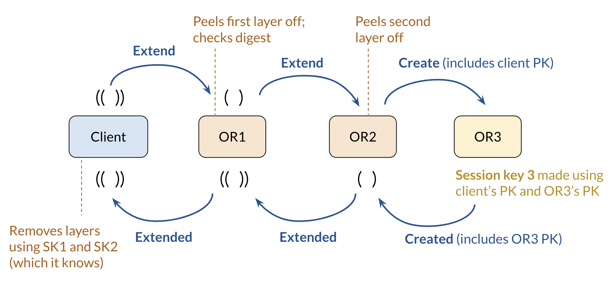

# Thor: The _Harvard_ Onion Router
A distributed system implementation of Tor with encrypted peer-to-peer communication.

Contributors: [@darkwood101](https://github.com/darkwood101/), [@cynthia9chen](https://github.com/cynthia9chen)

1. [Background](#1-background)
2. [System Design](#2-system-design)
3. [Running Tor262](#3-Running-Tor262)
4. [Real-World Application](#4-Real-World-Application)

## 1. Background

Thor262 is a distributed systems implementation of The Onion Router, widely known as Tor. We develop a peer-to-peer distributed system to enable encrypted communication between the client and respective onion routers. Our system relies on three onion routers, selected using a directory server, and the client maintains encrypted connection with these onion routers which eventually relay a connection request to a website in an anonymous manner. Finally, we deploy our system for a real-word application: connecting to ChatGPT in Italy, where it is currently banned, by relaying data through a series of onion routers hosted on international AWS instances.  

## 2. System Design

We define our own wire protocol for all messages exchanged between Thor participants. We maintain a directory server (DS) that manages a dynamic list of onion routers (ORs). We implement fault detection—the DS is able to detect fail-stop failures of any onion routers through heartbeat messages—and new onion routers can also join the network by sending a message to the directory server. 

**Overall system design:**



When a client establishes a connection with the DS, it is given the IP addresses of three onion routers with which it establishes a circuit with. We maintain encrypted communication between client and onion routers through various message types in the form of control cells (Create, Created, Destroy) and relay cells: Extend, Extended, Begin, Data, End). The diagram below explains how the 3rd onion router is established using these message types. Finally, the last onion router (typically OR3) in the circuit establishes a TCP connection with the given destination website <hostname, port> (usually HTTP(S)).

**Diagram explaining how the 3rd onion router is established using various message types:**



**Encrypted communication:**
- Mix of asymmetric and symmetric cryptography
- The directory server has a long-term private/public keypair — public key is well-known and is the root for our chain of trust
- ORs have a long-term private/public keypair for signatures – public keys are verified and signed by DS
- Client and ORs negotiate temporary secret keys during circuit creation


## 3. Running Tor262 locally
Generate key file:
```console
$ python3 generate_signing_key.py test.key
```

Start up the three ORs (in separate terminal windows):
```
$ python3 onion_router.py 127.0.0.1 50051 test.key
$ python3 onion_router.py 127.0.0.2 50051 test.key
$ python3 onion_router.py 127.0.0.3 50051 test.key
```

In the 4th terminal window, start the client:
```
$ python3 client.py
```

Sample client output:
```
OR 1 public key: b'4nX1LOdIt58fArZZW7VzHTwy0oXzzIA+x2TOK1AZ31A='
OR 1 hash of the session key: b'YHFSrnMw5CA2jw3NibhMqq7lcHPSnWQTez7FYcO3OhU='
OR 1 signature: b'V4YHx+nHbtN9Cc28fcM/gsDbiucwGDu451a60uUW95yRu9PU7HVpS2Nga5eczlwJptnYfx0f6uFpscRYPphcDA=='
My hash of OR 1 session key: b'YHFSrnMw5CA2jw3NibhMqq7lcHPSnWQTez7FYcO3OhU='
OR 2 public key: b'l/PFCyaEbQ4qfyLpm0I5kP05lhuUNwfHXF47yYBRtzs='
OR 2 hash of the session key: b'g3UqQqyFXd986OP5kORiL3156FAj1MZXmYDbrKFfwTU='
OR 2 signature: b'bnZyPzSMpnsTYjgnpKUW7+9sTb+IBPgsf6YwHO1SpHv2yfU9NhgpaY3yek6pO+y0bgP1Axi16FtHNmEdhPRLCw=='
My hash of OR 2 session key: b'g3UqQqyFXd986OP5kORiL3156FAj1MZXmYDbrKFfwTU='
OR 3 public key: b'a9XElfCnjltaT2LESYlznyF9/bGHHU0kMq2tZ4i2jUU='
OR 3 hash of the session key: b'Ce7kp0Q1t+xib2SI6932XKwJHMBLDYVt08b2eEt1jM4='
OR 3 signature: b'XSVz/J7OopjH0LODExPfOpll2HWgTiUANxoyU/WbbasxcHr8QE0E9Tc43FOmxvGv+4rJYvOujf+gDsW4zB5GAA=='
My hash of OR 3 session key: b'Ce7kp0Q1t+xib2SI6932XKwJHMBLDYVt08b2eEt1jM4='
```

"OR 1 hash of the session key" should match "My hash of OR 1 session key". The same goes for OR 2 and OR 3.


## 4. Real-World Application

ChatGPT is currently blocked in Italy. We use Thor to circumvent this ban by setting up onion routers hosted on international AWS instances and using the third onion router to establish a TCP connection with https://chat.openai.com using the ChatGPT API.
